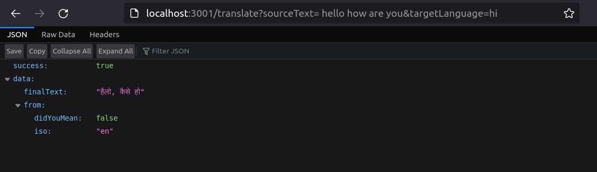
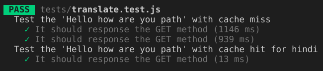

# Tech Stack Used
Node.js and Express.js  
lru-cache-node  
google-translate api  
Jest and Supertest for testing  

# Installation
Run ```npm install``` for installing dependicies  

# Running App
Run ```npm run devStart``` for running the web server  
Run ```npm run test``` to run predefined tests  

# Usage
Type ```http://localhost:3001/translate?sourceText=""&targetLanguage=""``` in the search bar where text to be translated should be inside sourceText and the needed language should be inside targetLangugae(user can use also use iso code for specifying language)


# Database Schema
Used [lru-cache-node](https://www.npmjs.com/package/lru-cache-node) for database. It is a non-persistent storage using least recently used policy. It uses doubly linked list to implement least recently used cache. It fetches data on an average of O(1).

# Evaluation
With cache miss the fetching of data was taking time in the order of 1000ms whereas with cache hits it was taking time in the order of 10ms.


# Further Ideas
1. Use of persistent data storage framework which also have efficient cache replacement policy (Redis can be used).  
2. Caching multiple languages that are related and storing them in cache to save time.  
